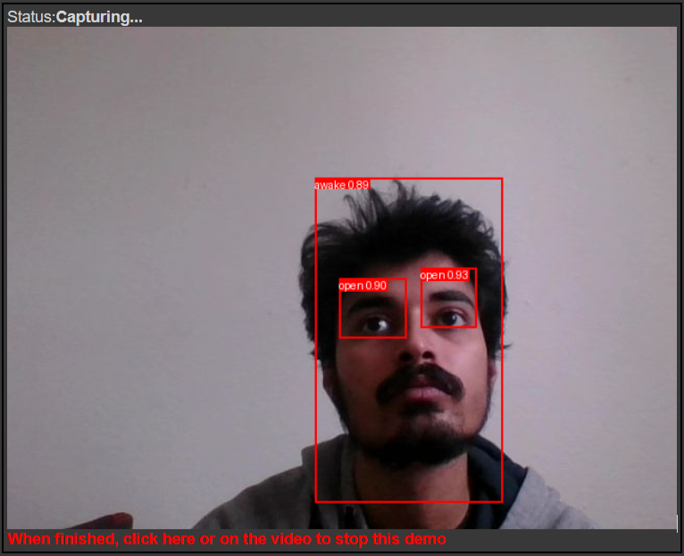

# Driver Drowsiness Detection System

## Project Overview
This project implements a real-time drowsiness detection system using a deep learning model based on the YOLOv5 architecture. It detects and classifies driver's eye and head positions to determine whether the driver is drowsy or awake, enhancing road safety.

## Features
- Real-time drowsiness detection using webcam feed.
- Uses YOLOv5 for object detection, specifically trained to recognize human eyes and face orientation.
- Bounding boxes indicating eye states (open or closed) and head position.
- Custom trained model to accurately detect specific user characteristics.

## Installation
To set up this project, follow the steps below:
1. **Run directly on Colab environment:**
   

## Usage
There are model weights to try out or you can train your own model. Just upload the model weights to Colab and change the weights path. Ensure your webcam is enabled and properly configured to allow real-time detection.

## Model Training
Trained Yolov5 model from [ultralytics](https://github.com/ultralytics/yolov5)
Dataset used: 44 images awake and drowsy images capturing various eye states and head positions.
Annotations: Labels indicating eye and head positions with bounding boxes. For this I have used [LabelImg](https://github.com/tzutalin/labelImg) 
Training procedure: Trained for 500 epochs:

 

## Detection:
 

